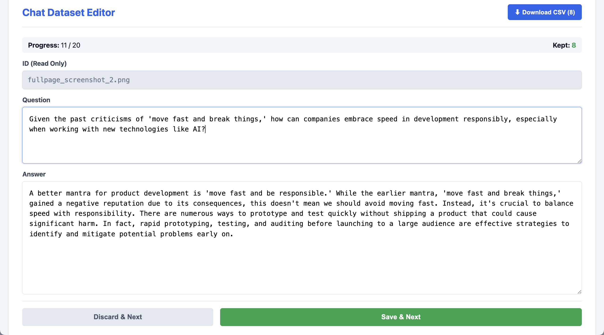

# Chat Dataset Editor
A local web based interface that you can use to cycle through, edit and then save the question/answer pairs in your chat dataset. Helpful when creating high quality question/answer pairs to fine tune LLMs. Works offline.

- Cycle through each row in your csv file
- Edit or discard each row
- Download the edited dataset as a csv file

 

The text in each field can be edited

 

## Required csv file format

Please ensure that your csv file has the following columns:
- id
- question
- answer

## How to run this app

- Download the project folder
- Place it on your desktop
- Double click the chat-dataset-editor.html file. The app will open  in your browser.
- Optional: Adjust the page zoom (Mac: command + or command -)
- Drag and drop your csv file
